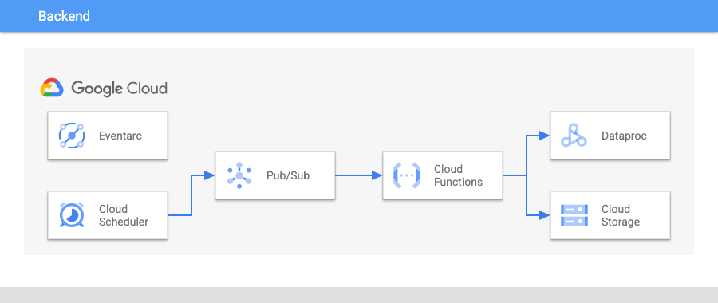

# dataproc-scheduled-cluster-sizing

## Table Of Contents

1. [Use Case](#use-case)
2. [About](#about)
3. [Architecture](#architecture)
4. [Guide](#guide)

----

## use-case

Use [Google Cloud Scheduler]() and [Google Cloud Functions]() to schedule the resizing of a [Dataproc]() cluster.  Changes the primary worker count.


In scenarios where [Workflow Templates]() and [Dataproc autoscaling]() aren't viable options for your cluster use-case, this code repo provides another solution for cost-optimization.


----

## about

When a Dataproc cluster is stopped, you are still charged for the attached [Persistent Disks]() of your worker nodes.  If you have a static/long-running cluster with many worker nodes, these costs can grow.  To prevent accumulating these costs without entirely deleting your cluster, you can deploy this solution to automatically resize your cluster at specific times.  

For example, let's say you have a 150 node Dataproc cluster with a long initialization process. Workflow Templates aren't a viable option because of the long startup time and potential for your init process to fail.  Downscaling a cluster can cause job stability issues, so you choose not to attach an autoscaling policy.  This means that you have a 150 node cluster that is always running.  Even if you stop the cluster, you'll still be charged for the 150 persistent disks being allocated.  If you know that your jobs all run between 2pm and 5pm, you can deploy this solution and set up Cloud Functions to automatically resize your cluster to 150 nodes at 1pm and then back down to 2 nodes at 6pm.

Saving you 19 hours of associated storage costs.

----

## architecture



----

## guide

To deploy the solution, simply run the following command.

```
./scripts/setup.sh -p <your project id> -n <your project number> -r <your region> -c <target dataproc cluster name> -i <new node count> -s <regex schedule>
```

this will deploy:

- Cloud Scheduler Job
- Cloud Function
- Cloud Storage Bucket
- Pubsub Topic 


----